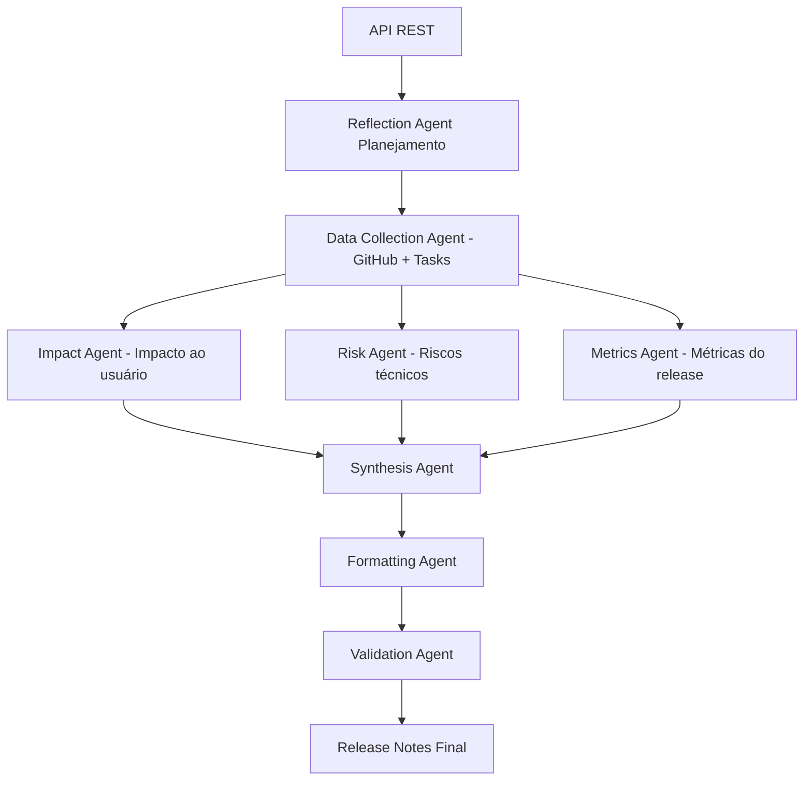

# Multi-Agent Release Notes Generator

# 📦 Multi-Agent Release Notes Generator

Sistema **multiagente inteligente** para **geração automática de release notes**, utilizando **LangChain**, integrando dados do **GitHub** e do **Jira**, exposto via **API REST em Python**.

O projeto simula a colaboração entre agentes especializados, apoiando atividades reais do dia a dia de um(a) **Tech Lead / Líder Técnico(a)**.

## Objetivo

Automatizar a criação de release notes claras, completas e rastreáveis com base em dados de desenvolvimento (commits, PRs, issues, bugs), reduzindo trabalho manual e risco de omissões.

## Visão Geral da Arquitetura



## Estrutura do Projeto

```text
.
├── app/
│   ├── agents/
│   │   ├── state.py
│   │   ├── reflection_agent.py
│   │   ├── data_collection_agent.py
│   │   ├── impact_analysis_agent.py
│   │   ├── risk_regression_agent.py
│   │   ├── metrics_agent.py
│   │   ├── synthesis_agent.py
│   │   ├── formatting_agent.py
│   │   └── validation_agent.py
│   ├── api/
│   │   ├── v1/
│   │   │   └── release_notes.py
│   │   └── router.py
│   ├── core/
│   │   └── config.py
│   ├── graphs/
│   │   └── release_notes_graph.py
│   ├── models/
│   │   └── release_notes.py
│   ├── services/
│   │   └── release_notes_service.py
│   └── main.py
├── tests/
│   ├── test_health.py
│   └── test_release_notes.py
├── .env.example
├── .gitignore
├── Makefile
├── pyproject.toml
├── requirements.txt
└── README.md
```

## Dependências Principais

- `fastapi`
- `uvicorn[standard]`
- `langgraph`
- `langchain`
- `langchain-openai`
- `pydantic`
- `pydantic-settings`
- `python-dotenv`
- `httpx`
- `pytest` (dev/test)

## Configuração do Ambiente

### Requisitos

- Python 3.11+
- `venv`

### 1) Criar ambiente virtual

```bash
python3 -m venv .venv
source .venv/bin/activate
```

### 2) Instalar dependências

```bash
make install
```

### 3) Configurar variáveis de ambiente

```bash
cp .env.example .env
```

Preencha com:

```env
APP_ENV=development
OPENAI_API_KEY=your_key
OPENAI_MODEL=gpt-4o-mini
OPENAI_TEMPERATURE=0.2
GITHUB_TOKEN=your_token
JIRA_BASE_URL=https://your-domain.atlassian.net
JIRA_EMAIL=your_email
JIRA_API_TOKEN=your_token
```

## Execução em Desenvolvimento

```bash
make run
```

- API: `http://localhost:8000`
- Swagger: `http://localhost:8000/docs`
- Health: `http://localhost:8000/health`

## Endpoint da API

### `POST /v1/release-notes`

Requisição:

```json
{
  "version": "v1.4.0",
  "from_date": "2026-01-01",
  "to_date": "2026-02-01",
  "audience": "clientes"
}
```

Resposta:

```json
{
  "status": "approved",
  "release_notes": "## Release v1.4.0\n..."
}
```

## Testes

```bash
make test
```

## Observações

- O workflow em `app/graphs/release_notes_graph.py` já está conectado com os nós principais de agentes.
- As integrações reais com GitHub/Jira podem ser implementadas no agente de coleta (`DataCollectionAgent`) e em serviços dedicados.
- O app usa chamadas ChatGPT (OpenAI) nos agentes de reflexão, síntese e formatação quando `OPENAI_API_KEY` está configurada.
