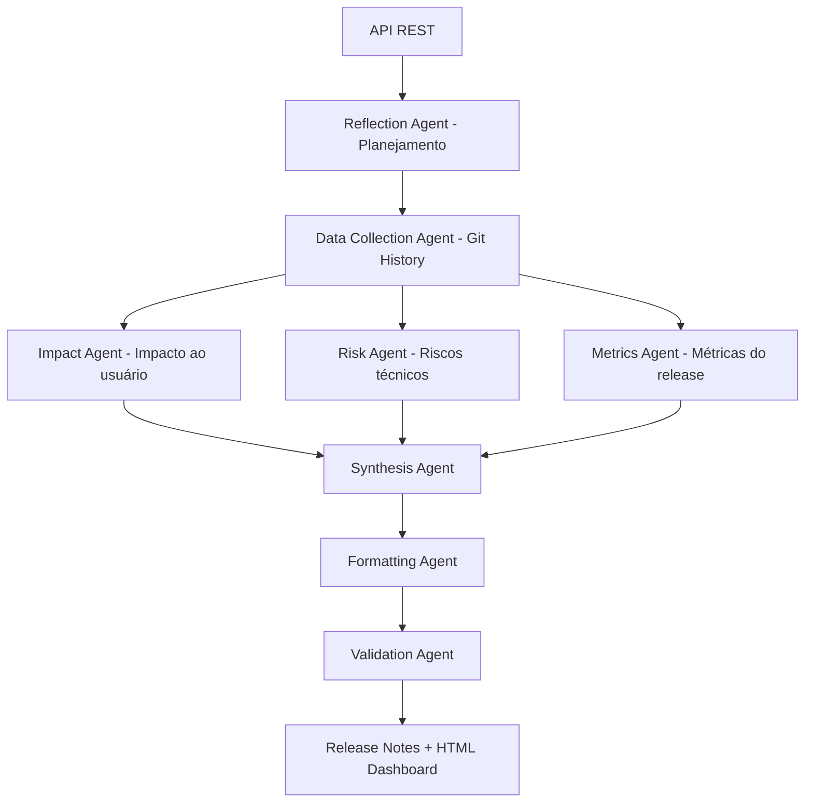

# 📦 Multi-Agent Release Notes Generator

Sistema **multiagente inteligente** para **geração automática de release notes reais**, utilizando **LangGraph + LangChain + LLM**, baseado diretamente no **histórico Git do projeto** e exposto via **API REST em Python (FastAPI)**.

O projeto simula a colaboração entre agentes especializados, reproduzindo o fluxo de trabalho de um(a) **Tech Lead** durante o processo de preparação de release.

---

## 🎯 Objetivo

Gerar release notes **factuais e automatizadas** a partir dos commits do repositório, reduzindo trabalho manual e eliminando inconsistências comuns na documentação de releases.

O sistema interpreta semanticamente os commits (`feat`, `fix`, `perf`, `breaking`) e transforma o histórico técnico em comunicação clara para diferentes públicos.

---

## 🧠 Arquitetura Multi-Agente



---

## ⚙️ Como o sistema funciona

1. A API recebe o período do release
2. O sistema lê commits reais via `git log`
3. Classifica semanticamente (feat, fix, perf, breaking)
4. Agentes analisam impacto, risco e métricas
5. Um agente sintetiza o release
6. Um agente revisor avalia qualidade
7. Um agente frontend gera um dashboard HTML executivo

Resultado: documentação técnica + executiva pronta para publicação.

---

## 📁 Estrutura do Projeto

```text
app/
 ├── agents/        # Especialistas de domínio (IA)
 ├── graphs/        # Orquestração LangGraph
 ├── services/      # Orquestrador da API
 ├── api/           # FastAPI endpoints
 ├── models/        # Schemas
 └── main.py        # Entry point
```

---

## 🔧 Requisitos

* Python 3.11 (recomendado)
* Git instalado e acessível no PATH
* Chave OpenAI

---

## 🚀 Configuração

### 1) Ambiente virtual

```bash
python -m venv .venv
source .venv/bin/activate
```

### 2) Instalar dependências

```bash
pip install -r requirements.txt
```

### 3) Variáveis de ambiente

```bash
cp .env.example .env
```

Preencher:

```env
OPENAI_API_KEY=your_key
OPENAI_MODEL=gpt-4o-mini
OPENAI_TEMPERATURE=0.2
```

⚠️ Não é mais necessário token do GitHub ou Jira.

---

## ▶️ Executar

```bash
uvicorn app.main:app --reload
```

Swagger:

```
http://localhost:8000/docs
```

---

## 📡 Endpoint

### POST `/v1/release-notes`

```json
{
  "version": "v1.4.0",
  "from_date": "2024-01-01",
  "to_date": "2024-12-31",
  "audience": "clientes"
}
```

---

## 📤 Resposta

```json
{
  "status": "approved",
  "release_notes": "markdown...",
  "html_report": "<html>...</html>",
  "score": 8
}
```

---

## 🧪 O que torna este projeto diferente

Este projeto não gera texto fictício.

Ele:

* lê commits reais
* interpreta semanticamente mudanças
* analisa impacto
* estima risco
* valida qualidade
* produz documentação executiva

Ou seja: funciona como um **Tech Lead virtual para preparação de release**.

---

## 📝 Observações

* O sistema depende de convenção de commits (`feat:`, `fix:` etc)
* Intervalos sem commits retornarão release vazio
* Projetado para ser integrado em CI/CD futuramente

---

## 👨‍💻 Caso de uso real

Pode ser usado para:

* preparar changelog automático
* gerar notas de versão para clientes
* documentação de deploy
* comunicação entre engenharia e negócio

---

## 🔮 Próximos passos possíveis

* Integração com GitHub API
* Integração com Jira real
* Execução automática no pipeline CI
* Publicação automática em Slack/Notion